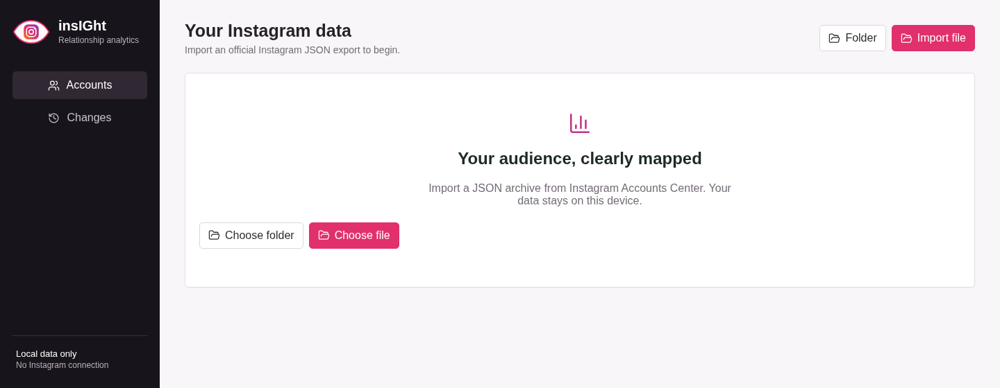

<div align="center">
  
  <h1>insIGht</h1>
  <p><strong>Private, local-first Instagram relationship analytics.</strong></p>
  <p>Understand followers, mutuals, non-reciprocal relationships, and changes over time without connecting your Instagram account.</p>

  [](https://github.com/almondsun/insight/actions/workflows/ci.yml)
  [](https://github.com/almondsun/insight/actions/workflows/codeql.yml)
  [](LICENSE)
  [](https://v2.tauri.app/)
</div>



## What It Does

insIGht turns Instagram's official **Download Your Information** JSON archive into a searchable desktop dashboard. It never asks for an Instagram password, uses no scraping or unofficial API, and does not upload relationship data.

| Capability | Description |
| --- | --- |
| Relationship dashboard | Followers, following, mutuals, not-following-back, and followers you do not follow |
| Snapshot history | Track multiple imports and identify additions or removals between snapshots |
| Searchable lists | Find accounts quickly across each relationship category |
| Multi-account support | Keep separate local histories for different Instagram accounts |
| Reports | Export normalized relationship lists as CSV or JSON |
| Local persistence | Store parsed snapshots in SQLite in the operating system's application-data directory |

## Privacy By Design

- **No Instagram login:** insIGht imports files you explicitly select.
- **No network dependency:** analytics and persistence run locally.
- **No telemetry:** the application does not track usage.
- **No archive retention:** source ZIP files are read in place and are not copied into app storage.
- **Minimal parsing:** only relationship files and owner metadata are read from a full export.
- **Defensive imports:** archive paths, file counts, individual sizes, and aggregate decompressed sizes are validated.

The local database and exported reports can contain personal information. They rely on your operating-system account and disk protection; database encryption is not currently included.

## Getting Instagram Data

1. Open Instagram **Accounts Center**.
2. Choose **Your information and permissions**.
3. Select **Download your information** and the Instagram account to export.
4. Choose **JSON** as the format. HTML exports are not supported.
5. Download the ZIP, then choose **Import file** in insIGht. Extracted export folders are also supported.

Instagram exports are snapshots, not event logs. A gained or lost relationship is known only to have changed between two imports. Instagram also does not reliably include stable numeric account IDs, so a username change can appear as one removal and one addition.

## Installation

### Releases

Download versioned desktop installers from the [GitHub Releases page](https://github.com/almondsun/insight/releases). Release assets are built for each supported platform; review the release notes for signing status and platform-specific limitations.

Supported release targets:

- Windows
- macOS
- Linux

## Development

### Prerequisites

- Node.js 22 or newer
- Rust stable
- [Tauri 2 platform prerequisites](https://v2.tauri.app/start/prerequisites/)

```bash
git clone https://github.com/almondsun/insight.git
cd insight
npm ci
npm run tauri dev
```

The standalone Vite server is useful for interface work, but imports, native dialogs, SQLite persistence, and exports require the Tauri runtime.

### Validation

Run the complete local CI-equivalent check:

```bash
npm run check
```

This runs the frontend production build, Rust formatting check, strict Clippy analysis, and Rust tests. Production dependencies are audited separately in CI with `npm audit --omit=dev`.

## Architecture

```text
Instagram JSON ZIP/folder
          |
          v
  Rust import boundary ---- path and decompression limits
          |
          v
 Normalized snapshots ---- SQLite in OS app-data storage
          |
          v
 Tauri commands/events ---- typed TypeScript client
          |
          v
 React desktop interface -- dashboard, lists, history, exports
```

- **React + TypeScript** renders the interface and manages query state.
- **Tauri + Rust** owns filesystem access, archive parsing, validation, reports, and native dialogs.
- **SQLite** stores accounts, immutable snapshots, and normalized relationships.
- Derived categories are computed from follower/following sets instead of persisted redundantly.

## Current Limitations

- Only official Instagram JSON exports are supported.
- Relationship changes are inferred between snapshots; exact change times are unavailable.
- Username changes cannot always be matched to the same person.
- The local database is not encrypted by insIGht.
- Installers are not yet code-signed or notarized.
- insIGht does not automate follows, unfollows, messaging, or other Instagram actions.

## Release Process

Version tags build draft installers through GitHub Actions. Maintainers verify each platform artifact before publishing it with release notes; see [the release guide](docs/RELEASING.md).

## Contributing

Read [CONTRIBUTING.md](CONTRIBUTING.md) before opening a pull request. Use the structured issue forms for bugs and feature proposals. Security reports must follow [SECURITY.md](SECURITY.md) and should never include a real Instagram export or personal account data.

## License

Licensed under the [MIT License](LICENSE).
