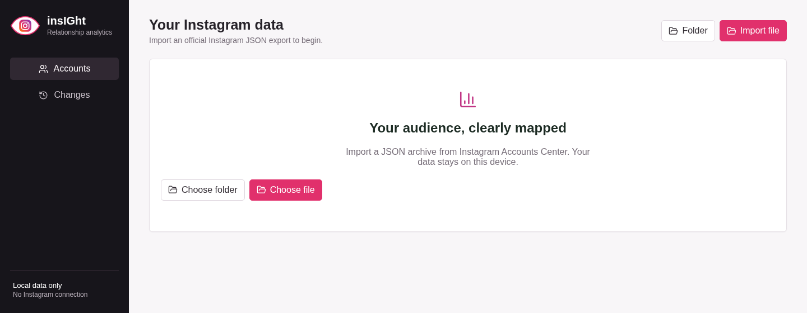

<div align="center">
  
  <h1>Nivune</h1>
  <p><strong>See who follows you, who does not, and what changed—without connecting your Instagram account.</strong></p>
  <p>Nivune is a local-first desktop app for exploring official Instagram JSON exports.</p>

  [](https://github.com/almondsun/nivune/releases/latest)
  [](https://github.com/almondsun/nivune/actions/workflows/ci.yml)
  [](https://github.com/almondsun/nivune/actions/workflows/codeql.yml)
  [](LICENSE)

  [Download the latest release](https://github.com/almondsun/nivune/releases/latest) · [Read the docs](docs/README.md) · [Get support](SUPPORT.md)
</div>



> [!IMPORTANT]
> Nivune is the name of current `main`. Existing v0.2 preview and v0.1.1 downloads retain the former insIGht name; a Nivune-branded release has not been published yet.

## Your Instagram relationships, made understandable

Instagram gives you a copy of your information, but not an easy way to explore it. Nivune turns the follower and following files in that official export into a searchable desktop dashboard.

| Explore | Compare | Keep control |
| --- | --- | --- |
| Browse followers, following, mutuals, and non-reciprocal relationships. | Import snapshots over time to see additions and removals. | Keep archives and analytics on your device, with no Instagram login or telemetry. |

> [!NOTE]
> Current `main` adds user-confirmed observation dates, an audience trend overview, arbitrary snapshot comparisons, per-account relationship history, and an original data-iris identity. These changes are not part of the downloadable preview.3 binaries yet.

### How it works

1. Request your information from Instagram Accounts Center in **JSON** format.
2. Import the complete ZIP or extracted export folder into Nivune.
3. Search relationships, compare snapshots, and export selected lists as CSV or JSON.

[Start with the installation and import guide →](docs/GETTING_STARTED.md)

## Features

- Followers, following, mutuals, accounts that do not follow you back, and followers you do not follow.
- Search across each relationship category.
- Separate histories for multiple Instagram accounts.
- Snapshot comparisons that show additions and removals between imports.
- User-confirmed observation dates and follower/following/mutual trend history.
- Arbitrary two-snapshot comparisons and per-username relationship timelines.
- Direction-filtered smart lists for new/lost followers and mutuals.
- Passphrase-encrypted, authenticated portable backups using the age format.
- Historical snapshot selection, account rename/delete, and change-report export.
- CSV and JSON reports saved through the operating system's native file dialog.
- Defensive ZIP and folder parsing with path, file-count, and decompressed-size limits.
- Local SQLite persistence in the operating system's application-data directory.

## Privacy, without vague promises

The v0.2 preview application does not log in to Instagram, scrape profiles, upload archives, use telemetry, or require a network connection for analytics. Rust owns file access and archive parsing; the WebView cannot choose arbitrary filesystem paths. The downloadable v0.1.1 release preserves the no-login, no-scraping, no-upload, and no-telemetry boundary, but predates the current native path mediation and stricter import validation.

Your local database and exported reports can still contain personal information. Nivune does not currently encrypt its live database, so protection depends on your operating-system account and disk security.

[Read the complete privacy and data-boundary documentation →](docs/PRIVACY.md)

## Downloads

Version 0.2.0-preview.3 provides unsigned builds and a release-wide `SHA256SUMS` file:

| Platform | Current artifact choices | Architecture |
| --- | --- | --- |
| Windows | MSI or setup EXE | x86-64 |
| macOS | DMG | Apple Silicon |
| Linux | AppImage, DEB, or RPM | x86-64 |

The installers are not code-signed or notarized. Windows and macOS may display an unknown-developer warning. Review the release notes and verify the SHA-256 digest shown by GitHub before installing.

[Download the v0.2 preview →](https://github.com/almondsun/nivune/releases/tag/v0.2.0-preview.3)

## Fame roadmap

Fame is a proposed optional ranking feature based on public follower and following counts. Its scoring, synthetic test foundations, lab CLI, and read-only status view exist, but **Fame retrieval and ranking are not available**. The research design requires a licensed query-independent corpus, independently operated PIR replicas, mixed request and reply paths, fixed cover traffic, witnessed releases, reproducible measurements, and independent audits. It forbids direct Instagram access and fallback transport.

[Read the roadmap](docs/ROADMAP.md) · [Review the Fame engineering status](docs/fame/README.md)

## Product identity

Nivune uses an original data-iris mark rather than platform iconography. Current `main` migrates the former `app.insight.local/insight.db` history into `app.nivune.local/nivune.db` exactly once and retains the legacy database file as a recovery copy.

## Documentation

- [Getting started](docs/GETTING_STARTED.md)
- [User guide](docs/USER_GUIDE.md)
- [Privacy and data handling](docs/PRIVACY.md)
- [Troubleshooting](docs/TROUBLESHOOTING.md)
- [Architecture](docs/ARCHITECTURE.md)
- [Development and contributing](CONTRIBUTING.md)

## Build from source

You need Node.js 22 or newer, the Rust toolchain pinned by `rust-toolchain.toml`, and the [Tauri 2 platform prerequisites](https://v2.tauri.app/start/prerequisites/).

```bash
git clone https://github.com/almondsun/nivune.git
cd nivune
npm ci
npm run tauri dev
```

Run the complete local CI-equivalent validation with:

```bash
npm run check
```

The standalone Vite server is useful for interface work, but native dialogs, archive imports, SQLite persistence, and exports require the Tauri runtime.

## Support and community

Use [GitHub Discussions](https://github.com/almondsun/nivune/discussions) for questions, the structured [issue forms](https://github.com/almondsun/nivune/issues/new/choose) for reproducible bugs or feature proposals, and the private process in [SECURITY.md](SECURITY.md) for vulnerabilities. Never publish a real Instagram export, username list, SQLite database, or login secret.

## Independent project

Nivune is not affiliated with, authorized, maintained, or endorsed by Instagram or Meta. Instagram is a trademark of its respective owner. This project reads export files that a user obtains through Instagram's official data-download feature.

## License

Nivune is available under the [MIT License](LICENSE).
