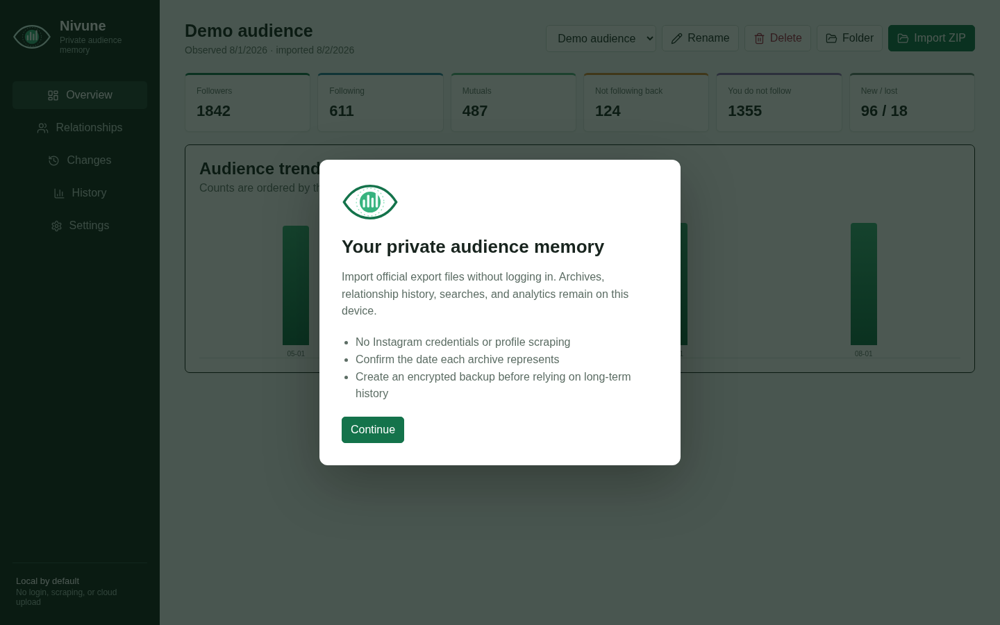
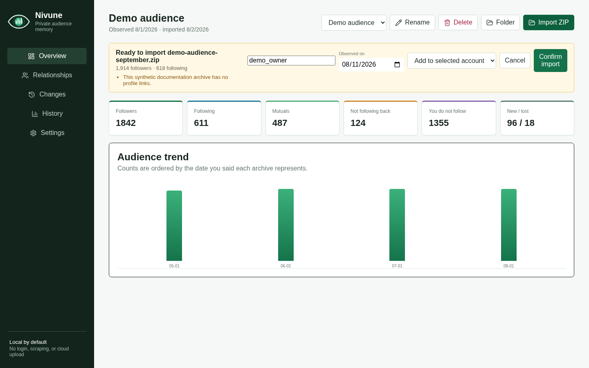

# Getting Started

This guide covers installing Nivune, requesting the right Instagram export, and creating your first local snapshot. The workflow targets Nivune Preview 4 and current `main`; older downloads retain the former name and differ as documented below.

## 1. Download the right build

Open the [v0.2.0-preview.4 prerelease](https://github.com/almondsun/nivune/releases/tag/v0.2.0-preview.4) and choose an artifact for your system.

| System | Choose | Notes |
| --- | --- | --- |
| Windows x86-64 | `.msi` or `-setup.exe` | Both install the desktop application. |
| macOS Apple Silicon | `aarch64.dmg` | Intel Mac builds are not currently published. |
| Debian or Ubuntu x86-64 | `amd64.deb` | Uses the system package manager. |
| Fedora, RHEL, or compatible x86-64 | `x86_64.rpm` | Uses the system package manager. |
| Other supported x86-64 Linux desktops | `amd64.AppImage` | Portable application image. |

Preview artifacts are not code-signed or notarized. Review the release notes and verify the artifact against the release's `SHA256SUMS` file. Do not disable operating-system security features globally to install Nivune or a former-name preview.

Windows or macOS may require you to confirm that you trust an unknown developer. Linux AppImage users may need to mark the downloaded file as executable through file properties or `chmod +x`.

## Version differences

Preview 4 is the first Nivune-branded download. Preview 3 and stable v0.1.1 use the former name; v0.1.1 also predates the hardened native path and complete-export boundary.

| Behavior | Preview 4 / current `main` | Former Preview 3 | Stable v0.1.1 |
| --- | --- | --- | --- |
| Product identity | Nivune data-iris identity and one-time legacy database migration. | Former identity and storage path. | Former identity and storage path. |
| Product workflow | Observation dates, trends, arbitrary comparisons, relationship timelines, smart lists, and encrypted backups. | Hardened imports and relationship analytics without the Preview 4 workflow additions. | Basic relationship lists and immediate-snapshot comparisons. |
| Import and export paths | Native code owns dialog results; the WebView cannot submit arbitrary paths. | Same native mediation. | The WebView supplies paths selected through the Tauri dialog plugin. |
| Accepted import selection | Complete ZIP or extracted folder containing both relationship directions. | Same complete-export requirement. | ZIP, folder, or individual JSON; partial relationship data is accepted. |
| Archive owner | Must be detected or entered and confirmed before commit. | Same owner confirmation. | No explicit owner-confirmation step. |
| Folder protections | Entry, depth, compressed/decompressed work, relationship-count, and aggregate limits. | Hardened boundary, without subsequent parser fixes documented in Preview 4 notes. | Relevant-file and per-file limits; no folder entry, depth, or aggregate-byte limit. |

All versions perform local analytics without Instagram credentials, scraping, archive upload, or telemetry. Use Preview 4 for the current product and strongest implemented parser boundary.

## 2. Request a JSON export from Instagram

Instagram changes the wording and layout of Accounts Center periodically. In Instagram or Accounts Center:

1. Open **Your information and permissions**.
2. Choose the option to download or export your information.
3. Select the Instagram account you want to analyze.
4. Include follower and following information, or request a complete export.
5. Select **JSON**, not HTML.
6. Create the export, then download the ZIP when Instagram says it is ready.

Keep the ZIP private. It can contain considerably more personal information than Nivune reads.

## 3. Import the archive

Launch Nivune and choose one of these paths:

- **Import ZIP** for the complete Instagram ZIP.
- **Folder** for the extracted root folder of that ZIP.

Preview 4 and current `main` require both the follower and following JSON files. HTML exports, individual JSON files, and partial exports are not supported. The v0.1.1 picker also displays individual JSON files, but a complete ZIP or extracted folder is still the recommended input.

Before anything is written to the database, Nivune shows an import preview with the source, detected totals, parser warnings, observation date, and archive owner. When owner metadata exists in the export, that value is shown read-only; otherwise, enter it yourself. Published v0.1.1 has a simpler preview without owner confirmation.





For a new account history, choose **Create new account** and provide a label. For a later export of the same account, add the snapshot to the already selected account.

## 4. Explore the dashboard

After confirmation, the newest snapshot becomes active. You can browse relationship categories, search by username, export a category, or import another snapshot to see changes.

Continue with the [user guide](USER_GUIDE.md), or see [troubleshooting](TROUBLESHOOTING.md) if the import is rejected.

## Build from source

Developers need Node.js 22 or newer, the Rust toolchain pinned by `rust-toolchain.toml`, and the [Tauri 2 prerequisites](https://v2.tauri.app/start/prerequisites/) for their platform.

```bash
git clone https://github.com/almondsun/nivune.git
cd nivune
npm ci
npm run tauri dev
```

Building from source does not add code signing or notarization.
