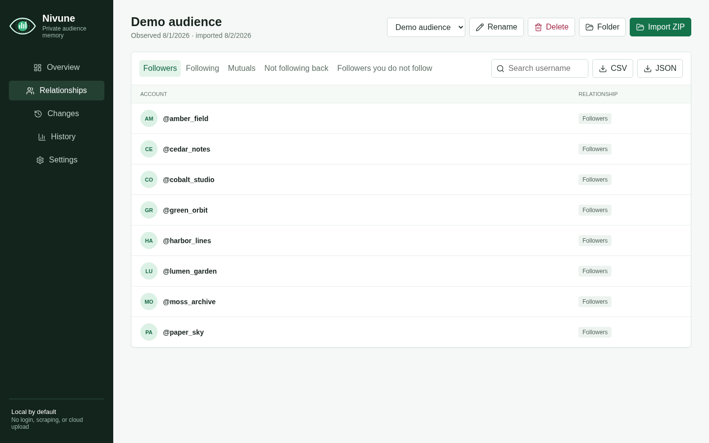
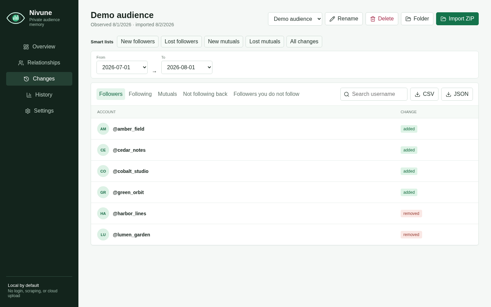
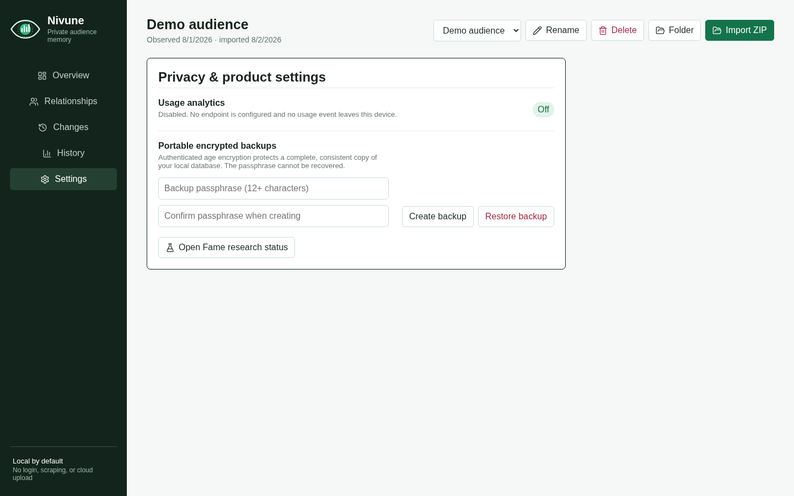
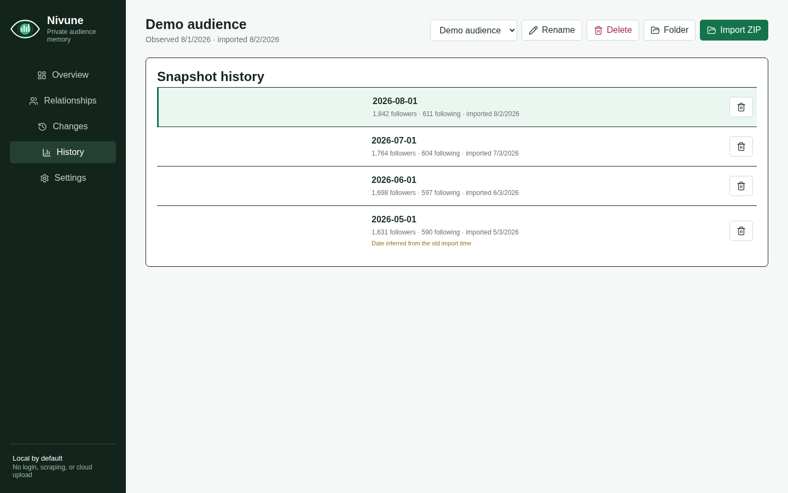

# User Guide

Nivune organizes official Instagram relationship exports into accounts and snapshots. An account is a local history; each import into that history is an immutable snapshot. This guide describes Preview 4 and current `main`; see [version differences](GETTING_STARTED.md#version-differences) for older former-name downloads.

## Accounts and snapshots

Use the account selector to switch between local histories. Import a later export into the matching account to build a timeline. Use a separate account for an export belonging to a different Instagram username.

The import preview shows the source filename, follower total, following total, parser warnings, observation date, and archive owner. Confirm these details before importing. Preview 4 rejects an owner username that conflicts with owner metadata in the archive. Published v0.1.1 does not include this owner-confirmation step.

Importing the same normalized follower and following membership twice is treated as a duplicate snapshot even if the ZIP filename or import time differs.

## Relationship categories

| Category | Meaning |
| --- | --- |
| Followers | Accounts present in the snapshot's follower files. |
| Following | Accounts present in the snapshot's following file. |
| Mutuals | Accounts that appear in both sets. |
| Not following back | Accounts you follow that are not in your follower set. |
| Followers you do not follow | Accounts in your follower set that you do not follow. |

Select a category and type part of a username in **Search username** to filter it. Usernames are matched without regard to letter case.

## Changes between imports

Open **Changes** after importing at least two snapshots into the same account. Choose any two distinct snapshots; Nivune marks usernames as added or removed within the selected relationship category. The New/Lost follower and mutual smart lists apply a direction filter to the same native comparison and export query.

Instagram exports are snapshots, not event logs. Nivune can only establish that a relationship differed between two imports; it cannot determine the exact moment of the change. Instagram also does not reliably provide a stable numeric account identifier, so a username change can appear as one removal and one addition.

## Export a relationship list or changes

Select a category, then choose **CSV** or **JSON**. The native save dialog lets you choose the destination. Reports contain the normalized relationship rows for the active snapshot and category.

In **Relationships**, the export buttons export the active relationship category. In **Changes**, they export the active comparison, category, and smart-list direction. JSON reports use a versioned schema; CSV text that could be interpreted as a spreadsheet formula is neutralized.

## Encrypted backups

Open **Settings**, enter a passphrase of at least 12 characters, and choose **Create backup**. The app saves a consistent copy of all accounts, snapshots, relationships, and local Fame scaffolding as an authenticated age-encrypted file. Store the passphrase separately; the app does not retain it and cannot recover it.

Restore validates the passphrase, authenticated encryption, 2 GB safety limit, SQLite integrity, schema, required tables, and application identity before replacing local history. Restore is destructive and requires confirmation. Backup encryption does not encrypt the live `nivune.db` file.

Treat reports as personal data: they may contain usernames and normalized Instagram profile URLs.

## Manage accounts and snapshots

In **History**, choose the trash button beside a snapshot and confirm deletion. Deletion removes that snapshot and its relationships from the local database. It cannot be undone through Nivune, although you can import the source archive again if you still have it.

Deleting an imported snapshot does not delete or modify the original ZIP or extracted folder.

Use **Rename** to change a local account label. Use **Delete** in the account header to remove the account and all associated snapshots after confirmation. These actions do not modify source archives.

## What Nivune reads

From a complete export, Nivune selects only:

- `following.json`
- `followers.json` or numbered `followers_*.json` files
- owner metadata from the nested personal-information file when present

It extracts usernames, sanitized canonical profile URLs when available, and relationship timestamps when present. It does not copy the source archive into application storage.

## Current limitations

- Preview 4 and current `main` support complete Instagram JSON ZIP exports and extracted export folders.
- Preview 4 and current `main` require both follower and following relationship files; published v0.1.1 accepts partial and standalone JSON input.
- The local SQLite database is not encrypted by Nivune.
- The Fame view reports engineering status only; retrieval and ranking remain unavailable.
